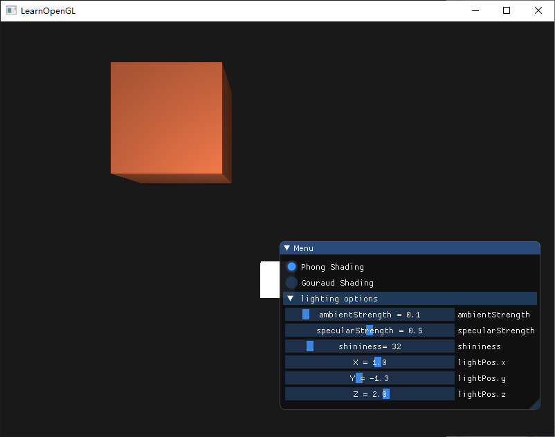

#  Homework 6

### 算法实现

顶点坐标引入法向量

```c++
	float vertices[] = {
		-0.5f, -0.5f, -0.5f,  0.0f,  0.0f, -1.0f,
		 0.5f, -0.5f, -0.5f,  0.0f,  0.0f, -1.0f,
		 ... ...
```

对于 Gouraud Shading 和 Phong Shading 以及光源 Lamp，分别为它们设置3个不同的着色器。

```c++
	Shader phongShader("Shader/Phong.vs", "Shader/Phong.fs");
	Shader gouraudShader("Shader/Gouraud.vs", "Shader/Gouraud.fs");
	Shader lampShader("Shader/lamp.vs", "Shader/lamp.fs");
```

#### Phong Shading 着色器实现

更新顶点着色器的输入，在顶点着色器中计算好 Frag 段的位置和法向量 Normal

```c++
#version 330 core
layout (location = 0) in vec3 aPos;
layout (location = 1) in vec3 aNormal;

out vec3 FragPos;
out vec3 Normal;

uniform mat4 model;
uniform mat4 view;
uniform mat4 projection;

void main()
{
    FragPos = vec3(model * vec4(aPos, 1.0));
    Normal = mat3(transpose(inverse(model))) * aNormal;  
 
    gl_Position = projection * view * vec4(FragPos, 1.0);
}
```

在片段着色器中计算环境(Ambient)、漫反射(Diffuse)和镜面(Specular)光照，控制参数为uniform变量，可以在主程序中由GUI进行修改，光照效果会实时改变。

```c++
#version 330 core
out vec4 FragColor;

in vec3 Normal;  
in vec3 FragPos;  
  
uniform vec3 lightPos; 
uniform vec3 viewPos; 
uniform vec3 lightColor;
uniform vec3 objectColor;

uniform float ambientStrength;
uniform float specularStrength;
uniform int shininess;

void main()
{
    vec3 ambient = ambientStrength * lightColor;

	vec3 norm = normalize(Normal);
	vec3 lightDir = normalize(lightPos - FragPos);
	float diff = max(dot(norm, lightDir), 0.0);
	vec3 diffuse = diff * lightColor;

	vec3 viewDir = normalize(viewPos - FragPos);
	vec3 reflectDir = reflect(-lightDir, norm);
	float spec = pow(max(dot(viewDir, reflectDir), 0.0), shininess);
	vec3 specular = specularStrength * spec * lightColor;

	vec3 result = (ambient + diffuse + specular) * objectColor;
	FragColor = vec4(result, 1.0);
}
```

#### Gouraud Shading 着色器实现

Gouraud Shading 区别于 Phong Shading 的地方在于，它是在顶点着色器中计算光模型的，然后在片段着色器中进行插值计算来得到立方体的颜色。由于插值，这种光照看起来有点逊色。冯氏着色能产生更平滑的光照效果。

我们只需要把 Phong Shading 片段着色器中的计算光照的逻辑迁移到顶点着色器中即可以完成Gouraud Shading 的实现。

顶点着色器

```c++
#version 330 core
layout (location = 0) in vec3 aPos;
layout (location = 1) in vec3 aNormal;

uniform mat4 model;
uniform mat4 view;
uniform mat4 projection;

out vec3 result;

uniform vec3 objectColor;
uniform vec3 lightColor;
uniform vec3 lightPos;
uniform vec3 viewPos;

uniform float ambientStrength;
uniform float specularStrength;
uniform int shininess;

void main()
{
    gl_Position = projection * view * model * vec4(aPos, 1.0);
    vec3 Position = vec3(model * vec4(aPos, 1.0));
	vec3 Normal = mat3(transpose(inverse(model))) * aNormal;

    vec3 ambient = ambientStrength * lightColor;

	vec3 norm = normalize(Normal);
	vec3 lightDir = normalize(lightPos - Position);
	float diff = max(dot(norm, lightDir), 0.0);
	vec3 diffuse = diff * lightColor;

	vec3 viewDir = normalize(viewPos - Position);
	vec3 reflectDir = reflect(-lightDir, norm);
	float spec = pow(max(dot(viewDir, reflectDir), 0.0), shininess);
	vec3 specular = specularStrength * spec * lightColor;

	result = (ambient + diffuse + specular) * objectColor;
}
```

片段着色器

```
#version 330 core

in vec3 result;
out vec4 FragColor;

void main()
{
	FragColor = vec4(result, 1.0);
}
```

#### Bonus:使光源移动

定义一个vec3保存光源的坐标，使用ImGui进行改变，然后再shader中设置

```c++
	// lighting
	glm::vec3 lightPos(1.2f, 1.0f, 2.0f);
	ImGui::SliderFloat("lightPos.x", &lightPos.x, -10.0f, 10.0f, "X = %.1f");
	ImGui::SliderFloat("lightPos.y", &lightPos.y, -10.0f, 10.0f, "Y = %.1f");
	ImGui::SliderFloat("lightPos.z", &lightPos.z, -10.0f, 10.0f, "Z = %.1f");
	lightingShader.setVec3("lightPos", lightPos);
```

### 实验截图


