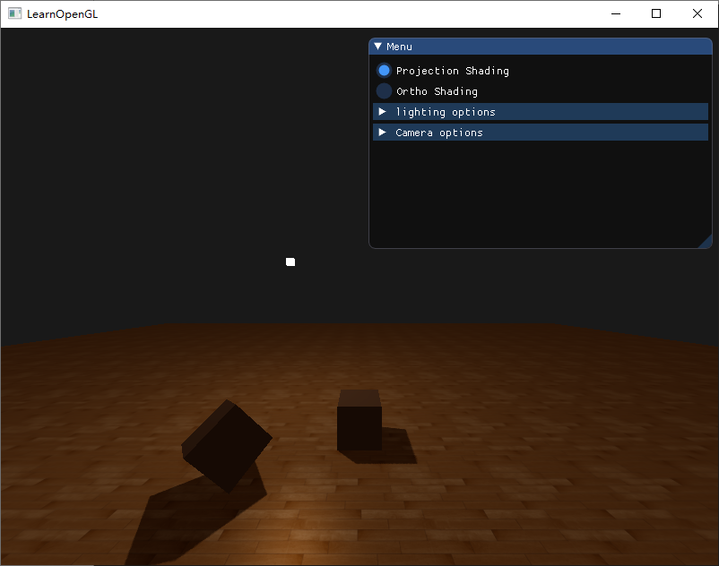
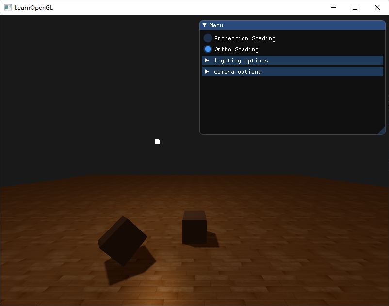

# Homework7

### 1. 实现光源在正交/透视两种投影下的Shadowing Mapping

#### 实验截图

透视投影



正交投影



#### 算法描述


上图很好的解释了Shadow Mapping的原理

1. 首先将摄像机设置到光源所在的位置(观察方向面对场景，此时叫摄像机观察矩阵为观察矩阵1”，同时设置合理的投影矩阵(这里称此矩阵为投影矩阵1)。

2.  然后对与景进行第二次绘制.此次绘制将每个可以看见的片元(可以观察到指的是片元到光源间无遮挡)到光源的距离记录到一幅纹理图中的对应像素中，供后面的步骤使用。

3.  接着将摄像机恢复到实际摄像机所处的位置，绘制场景。此次绘制时将前面步骤产生的纹理采用投影贴图的方式应用到场景中，进行投影贴图时采用的投影矩阵为投影矩阵1、观察矩阵为观察矩阵1. 

4.  绘制每个片元时，根据投影贴图纹理采样的结果换算出光源与此片元连线中距光源最近的片元距离(ZA)，再计算出此片元距光源的实际距离(ZB)。若ZB>ZA，则需要绘制的片元处于阴影中，采用阴影的颜色着色，否则此片兀不在阴影中，进行既定的光照着色。

#### 代码实现

##### 深度贴图

首先，我们要为渲染的深度贴图创建一个帧缓冲对象：

```c++
GLuint depthMapFBO;
glGenFramebuffers(1, &depthMapFBO);
```

然后，创建一个2D纹理，提供给帧缓冲的深度缓冲使用：

```c++
const GLuint SHADOW_WIDTH = 1024, SHADOW_HEIGHT = 1024;

GLuint depthMap;
glGenTextures(1, &depthMap);
glBindTexture(GL_TEXTURE_2D, depthMap);
glTexImage2D(GL_TEXTURE_2D, 0, GL_DEPTH_COMPONENT, 
             SHADOW_WIDTH, SHADOW_HEIGHT, 0, GL_DEPTH_COMPONENT, GL_FLOAT, NULL);
glTexParameteri(GL_TEXTURE_2D, GL_TEXTURE_MIN_FILTER, GL_NEAREST);
glTexParameteri(GL_TEXTURE_2D, GL_TEXTURE_MAG_FILTER, GL_NEAREST);
glTexParameteri(GL_TEXTURE_2D, GL_TEXTURE_WRAP_S, GL_REPEAT); 
glTexParameteri(GL_TEXTURE_2D, GL_TEXTURE_WRAP_T, GL_REPEAT);
```

生成深度贴图不太复杂。因为我们只关心深度值，我们要把纹理格式指定为GL_DEPTH_COMPONENT。我们还要把纹理的高宽设置为1024：这是深度贴图的解析度。

把我们把生成的深度纹理作为帧缓冲的深度缓冲：

```c++
glBindFramebuffer(GL_FRAMEBUFFER, depthMapFBO);
glFramebufferTexture2D(GL_FRAMEBUFFER, GL_DEPTH_ATTACHMENT, GL_TEXTURE_2D, depthMap, 0);
glDrawBuffer(GL_NONE);
glReadBuffer(GL_NONE);
glBindFramebuffer(GL_FRAMEBUFFER, 0);
```

我们需要的只是在从光的透视图下渲染场景的时候深度信息，所以颜色缓冲没有用。然而帧缓冲对象不是完全不包含颜色缓冲的，所以我们需要显式告诉OpenGL我们不适用任何颜色数据进行渲染。我们通过将调用glDrawBuffer和glReadBuffer把读和绘制缓冲设置为GL_NONE来做这件事。

合理配置将深度值渲染到纹理的帧缓冲后，我们就可以开始第一步了：生成深度贴图。两个步骤的完整的渲染阶段，看起来有点像这样：

```c++
// 1. 首选渲染深度贴图
glViewport(0, 0, SHADOW_WIDTH, SHADOW_HEIGHT);
glBindFramebuffer(GL_FRAMEBUFFER, depthMapFBO);
    glClear(GL_DEPTH_BUFFER_BIT);
    ConfigureShaderAndMatrices();
    RenderScene();
glBindFramebuffer(GL_FRAMEBUFFER, 0);
// 2. 像往常一样渲染场景，但这次使用深度贴图
glViewport(0, 0, SCR_WIDTH, SCR_HEIGHT);
glClear(GL_COLOR_BUFFER_BIT | GL_DEPTH_BUFFER_BIT);
ConfigureShaderAndMatrices();
glBindTexture(GL_TEXTURE_2D, depthMap);
RenderScene();
```

##### 光源空间的变换

正交投影和透视投影的区别就是投影矩阵的不同，通过imgui可以实现切换。

```c++
glm::mat4 lightProjection, lightView;
glm::mat4 lightSpaceMatrix;
GLfloat near_plane = 1.0f, far_plane = 7.5f;
if (mode == 1) {
	// Orthographic 
	lightProjection = glm::ortho(-10.0f, 10.0f, -10.0f, 10.0f, near_plane, far_plane);
}
else {
	// Projection
	lightProjection = glm::perspective(124.0f, (float)SHADOW_WIDTH / (float)SHADOW_HEIGHT, near_plane, far_plane);
}
lightView = glm::lookAt(lightPos, glm::vec3(0.0f), glm::vec3(0.0, 1.0, 0.0));
lightSpaceMatrix = lightProjection * lightView;
// - render scene from light's point of view
simpleDepthShader.use();
simpleDepthShader.setMat4("lightSpaceMatrix", lightSpaceMatrix);
```

##### 渲染至深度贴图

当我们以光的透视图进行场景渲染的时候，我们会用一个比较简单的着色器，这个着色器除了把顶点变换到光空间以外，不会做得更多了。这个简单的着色器叫做`simpleDepthShader`，顶点着色器将一个单独模型的一个顶点，使用lightSpaceMatrix变换到光空间中，而片段着色器什么也不用干。

```c
#version 330 core
layout (location = 0) in vec3 position;

uniform mat4 lightSpaceMatrix;
uniform mat4 model;

void main()
{
    gl_Position = lightSpaceMatrix * model * vec4(position, 1.0f);
}
```

渲染深度缓冲

```c++
simpleDepthShader.Use();
glUniformMatrix4fv(lightSpaceMatrixLocation, 1, GL_FALSE, glm::value_ptr(lightSpaceMatrix));

glViewport(0, 0, SHADOW_WIDTH, SHADOW_HEIGHT);
glBindFramebuffer(GL_FRAMEBUFFER, depthMapFBO);
    glClear(GL_DEPTH_BUFFER_BIT);
    RenderScene(simpleDepthShader);
glBindFramebuffer(GL_FRAMEBUFFER, 0);
```

##### 渲染阴影

在顶点着色器中进行光空间的变换。我们用同一个lightSpaceMatrix，把世界空间顶点位置转换为光空间。顶点着色器传递一个普通的经变换的世界空间顶点位置vs_out.FragPos和一个光空间的vs_out.FragPosLightSpace给像素着色器。

```c++
#version 330 core
layout (location = 0) in vec3 aPos;
layout (location = 1) in vec3 aNormal;
layout (location = 2) in vec2 aTexCoords;

out vec2 TexCoords;

out VS_OUT {
    vec3 FragPos;
    vec3 Normal;
    vec2 TexCoords;
    vec4 FragPosLightSpace;
} vs_out;

uniform mat4 projection;
uniform mat4 view;
uniform mat4 model;
uniform mat4 lightSpaceMatrix;

void main()
{
    vs_out.FragPos = vec3(model * vec4(aPos, 1.0));
    vs_out.Normal = transpose(inverse(mat3(model))) * aNormal;
    vs_out.TexCoords = aTexCoords;
    vs_out.FragPosLightSpace = lightSpaceMatrix * vec4(vs_out.FragPos, 1.0);
    gl_Position = projection * view * model * vec4(aPos, 1.0);
}
```

像素着色器使用Blinn-Phong光照模型渲染场景。我们接着计算出一个shadow值，当fragment在阴影中时是1.0，在阴影外是0.0。然后，diffuse和specular颜色会乘以这个阴影元素。由于阴影不会是全黑的（由于散射），我们把ambient分量从乘法中剔除。

shadowCalculation函数用于计算阴影。像素着色器的最后，我们我们把diffuse和specular乘以(1-阴影元素)，这表示这个片元有多大成分不在阴影中。这个像素着色器还需要两个额外输入，一个是光空间的片元位置和第一个渲染阶段得到的深度贴图。

```c++
#version 330 core
out vec4 FragColor;

in VS_OUT {
    vec3 FragPos;
    vec3 Normal;
    vec2 TexCoords;
    vec4 FragPosLightSpace;
} fs_in;

uniform sampler2D diffuseTexture;
uniform sampler2D shadowMap;

uniform vec3 lightPos;
uniform vec3 viewPos;

float ShadowCalculation(vec4 fragPosLightSpace)
{
    [...]
}

void main()
{           
    vec3 color = texture(diffuseTexture, fs_in.TexCoords).rgb;
    vec3 normal = normalize(fs_in.Normal);
    vec3 lightColor = vec3(1.0);
    // Ambient
    vec3 ambient = 0.15 * color;
    // Diffuse
    vec3 lightDir = normalize(lightPos - fs_in.FragPos);
    float diff = max(dot(lightDir, normal), 0.0);
    vec3 diffuse = diff * lightColor;
    // Specular
    vec3 viewDir = normalize(viewPos - fs_in.FragPos);
    vec3 reflectDir = reflect(-lightDir, normal);
    float spec = 0.0;
    vec3 halfwayDir = normalize(lightDir + viewDir);  
    spec = pow(max(dot(normal, halfwayDir), 0.0), 64.0);
    vec3 specular = spec * lightColor;    
    // 计算阴影
    float shadow = ShadowCalculation(fs_in.FragPosLightSpace);       
    vec3 lighting = (ambient + (1.0 - shadow) * (diffuse + specular)) * color;    

    FragColor = vec4(lighting, 1.0f);
}
```

最后激活这个着色器，绑定合适的纹理，激活第二个渲染阶段默认的投影以及视图矩阵。

### 2. 优化Shadowing Mapping

#### 阴影失真

因为阴影贴图受限于解析度，在距离光源比较远的情况下，多个片元可能从深度贴图的同一个值中去采样。图片每个斜坡代表深度贴图一个单独的纹理像素。你可以看到，多个片元从同一个深度值进行采样。

虽然很多时候没问题，但是当光源以一个角度朝向表面的时候就会出问题，这种情况下深度贴图也是从一个角度下进行渲染的。多个片元就会从同一个斜坡的深度纹理像素中采样，有些在地板上面，有些在地板下面；这样我们所得到的阴影就有了差异。因为这个，有些片元被认为是在阴影之中，有些不在，由此产生了图片中的条纹样式。

我们可以用一个叫做**阴影偏移**（shadow bias）的技巧来解决这个问题，我们简单的对表面的深度（或深度贴图）应用一个偏移量，这样片元就不会被错误地认为在表面之下了。

```
float bias = 0.005;
float shadow = currentDepth - bias > closestDepth  ? 1.0 : 0.0;
```

#### 悬浮

这个阴影失真叫做悬浮(Peter Panning)，因为物体看起来轻轻悬浮在表面之上，我们可以使用一个叫技巧解决大部分的Peter panning问题：当渲染深度贴图时候使用正面剔除（front face culling）

```c++
glCullFace(GL_FRONT);
RenderSceneToDepthMap();
glCullFace(GL_BACK); // 不要忘记设回原先的culling face
```

#### 采样过多

光的视锥不可见的区域一律被认为是处于阴影中，不管它真的处于阴影之中。出现这个状况是因为超出光的视锥的投影坐标比1.0大，这样采样的深度纹理就会超出他默认的0到1的范围。根据纹理环绕方式，我们将会得到不正确的深度结果，它不是基于真实的来自光源的深度值。

发生这种情况的原因是我们之前将深度贴图的环绕方式设置成了GL_REPEAT。我们宁可让所有超出深度贴图的坐标的深度范围是1.0，这样超出的坐标将永远不在阴影之中。我们可以储存一个边框颜色，然后把深度贴图的纹理环绕选项设置为GL_CLAMP_TO_BORDER：

```c++
glTexParameteri(GL_TEXTURE_2D, GL_TEXTURE_WRAP_S, GL_CLAMP_TO_BORDER);
glTexParameteri(GL_TEXTURE_2D, GL_TEXTURE_WRAP_T, GL_CLAMP_TO_BORDER);
GLfloat borderColor[] = { 1.0, 1.0, 1.0, 1.0 };
glTexParameterfv(GL_TEXTURE_2D, GL_TEXTURE_BORDER_COLOR, borderColor);
```

#### PCF

因为深度贴图有一个固定的解析度，多个片元对应于一个纹理像素。结果就是多个片元会从深度贴图的同一个深度值进行采样，这几个片元便得到的是同一个阴影，这就会产生锯齿边。

一个（并不完整的）解决方案叫做PCF（percentage-closer filtering），这是一种多个不同过滤方式的组合，它产生柔和阴影，使它们出现更少的锯齿块和硬边。核心思想是从深度贴图中多次采样，每一次采样的纹理坐标都稍有不同。每个独立的样本可能在也可能不再阴影中。所有的次生结果接着结合在一起，进行平均化，我们就得到了柔和阴影。

一个简单的PCF的实现是简单的从纹理像素四周对深度贴图采样，然后把结果平均起来：

```c++
float shadow = 0.0;
vec2 texelSize = 1.0 / textureSize(shadowMap, 0);
for(int x = -1; x <= 1; ++x)
{
    for(int y = -1; y <= 1; ++y)
    {
        float pcfDepth = texture(shadowMap, projCoords.xy + vec2(x, y) * texelSize).r; 
        shadow += currentDepth - bias > pcfDepth ? 1.0 : 0.0;        
    }    
}
shadow /= 9.0;
```

这个textureSize返回一个给定采样器纹理的0级mipmap的vec2类型的宽和高。用1除以它返回一个单独纹理像素的大小，我们用以对纹理坐标进行偏移，确保每个新样本，来自不同的深度值。这里我们采样得到9个值，它们在投影坐标的x和y值的周围，为阴影阻挡进行测试，并最终通过样本的总数目将结果平均化。